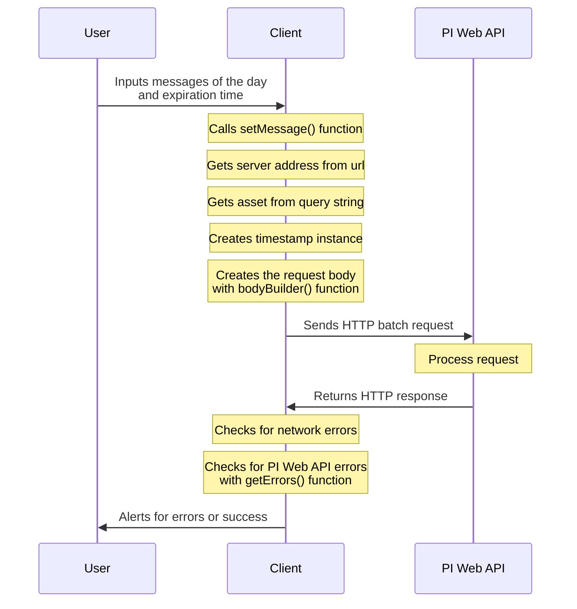

# FEWS Message of the Day

A simple website that allows users to set daily messages.

## Features

- Simple and intuitive interface
- Auto-authorization
- Cleaner notifications
- Powered by PI Web API 

## Colaborators

- Kaio Lima
- Gabriel Jamur
- Henrique Lozano

## Documentation

The Message of the Day (MOTD) application is structured around a singular HTML file. This file incorporates various input elements and invokes three distinct JavaScript scripts that collectively operationalize the application. These scripts are `checkSetTime.js`, `getStyle.js`, and `setMessage.js`. 

The `checkSetTime.js` script is responsible for verifying the expiration time is set correctly. The `getStyle.js` script, while not requiring an extensive explanation, primarily serves to enhance the aesthetic appeal of the website by implementing styles from the TailwindCSS CDN that was prevalent in early 2024. Lastly, the `setMessage.js` script is tasked with generation the HTTP request for the PI Web API and applying the desired changes. Together, these scripts ensure the seamless functionality of the MOTD application.

The aplication recieves four parameters, three of them are messages for one of three lines, and the last one corresponds to the duration in hours that the messages will be displayed.

### Process Diagram

