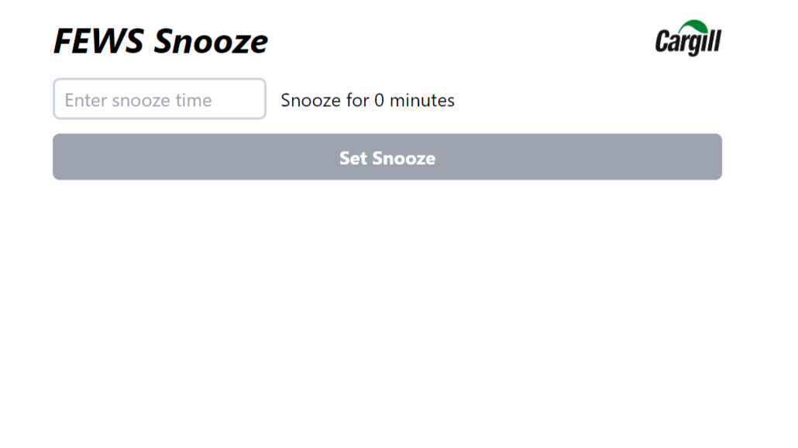
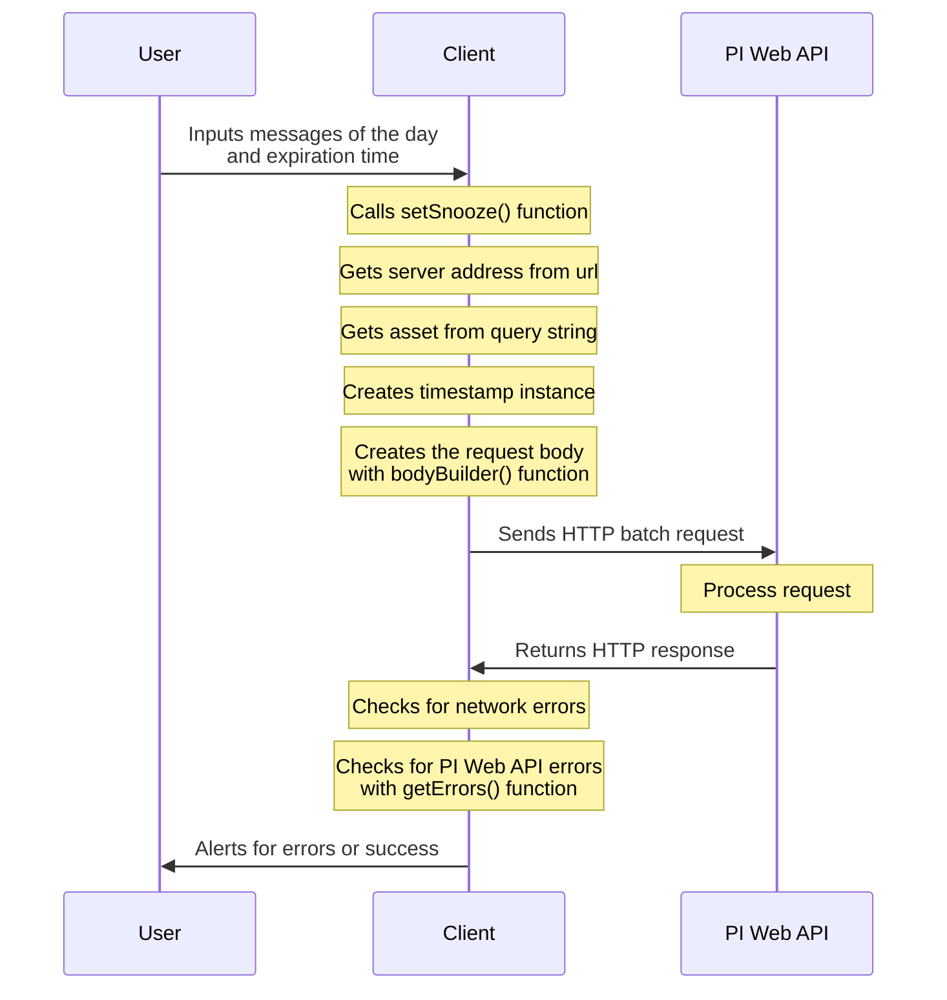

# FEWS Snooze

A simple website that allows users to ignore PI Notifications from specific tags.

## Features

- Simple and intuitive interface
- Auto-authorization
- Cleaner notifications
- Powered by PI Web API

## Colaborators

- Kaio Lima
- Henrique Lozano

## Documentation

The Snooze application is structured around a singular HTML file. This file incorporates various input elements and invokes three distinct JavaScript scripts that collectively operationalize the application. These scripts are `checkSnoozeValue.js`, `getStyle.js`, and `setSnooze.js`.

The `checkSnoozeValue.js` script is responsible for verifying the snooze time is valid. The `getStyle.js` script, while not requiring an extensive explanation, primarily serves to enhance the aesthetic appeal of the website by implementing styles from the TailwindCSS CDN that was prevalent in early 2024. Lastly, the `setSnooze.js` script is tasked with generation the HTTP request for the PI Web API and applying the desired changes. Together, these scripts ensure the seamless functionality of the MOTD application.

The aplication recieves a single parameter that determines the duration in minutes that notifications will be ignored.

### Process Diagram

